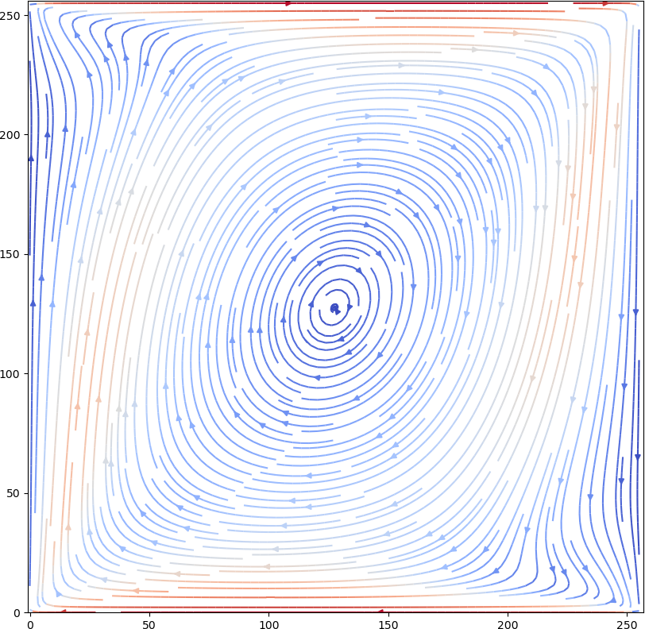

# A simple Lattice Boltzmann Method (fluid dynamics simulation) implementation.

Implements a single-phase 2D fluid simulation on a cell lattice using the single relaxation time BGK model (lbmlib submodule) and several simulation visualization applications: 
* A console application updating the lattice state (cell density/velocity magnitude) for each timestep in the terminal window.  
* A simple GUI application drawing the lattice state to the screen.
* An OpenGL application with much faster rendering and customizable colormaps.

    <figure>
        
        <figcaption>Example: vector field inside a 256x256 box with top and bottom sliding in different directions after ~30000 simulation steps. Plotted with Matplotlib.</figcaption>
    </figure>

